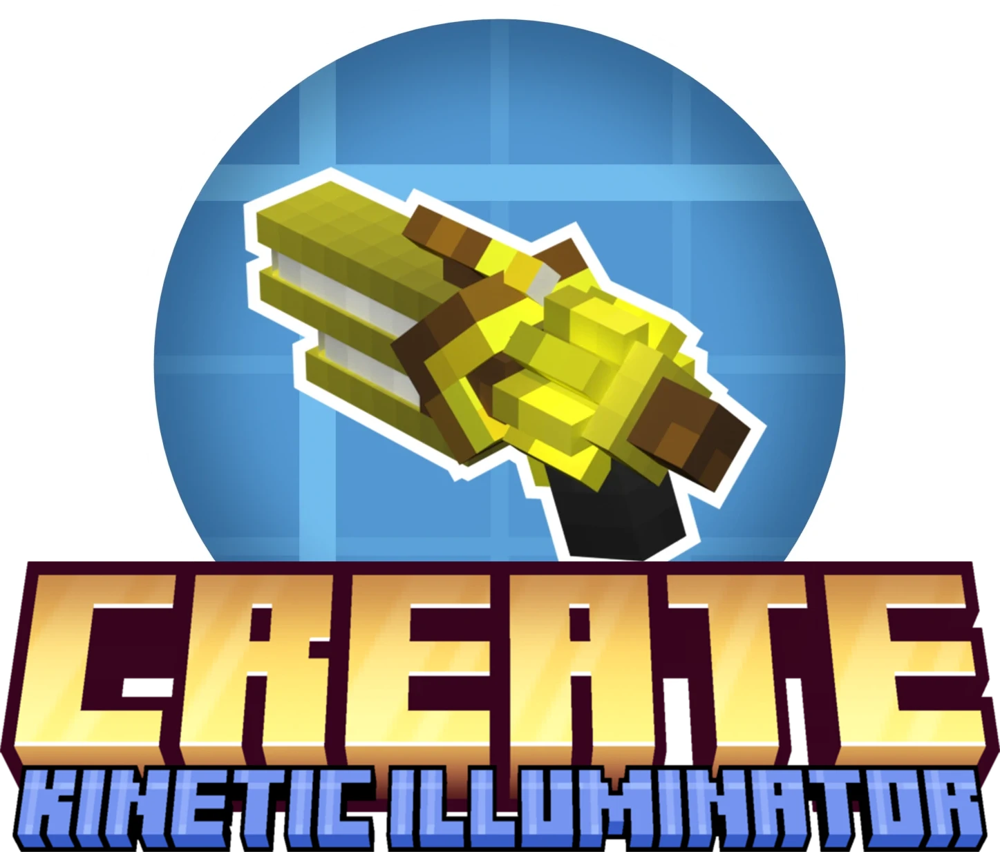
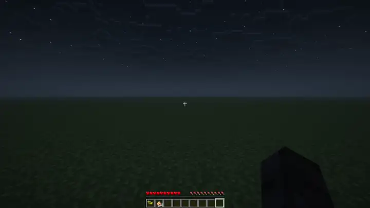

  
    
  
  &nbsp
  
  &nbsp
  
    
  
  &nbsp
  

# 💡 Create: Kinetic Illuminator

An addon for the [Create](https://github.com/Creators-of-Create/Create) mod for Minecraft. It adds a new curiosity: the
Kinetic Illuminator. It can be used to place invisible light blocks at the expense of some Glowstone Dust. Scrolling
while crouching will let you change the light level of the light blocks that will be placed. When right-clicking already
placed light blocks, they will be destroyed again. Light blocks can also be placed inside of water.

Here is how it looks ingame:

## Cost of Glowstone Dust

Placing light blocks with lower light levels will consume less Glowstone Dust. The following table displays the cost for
each light level:

| Light level | Cost |
|-------------|------|
| 1-3         | 1    |
| 4-7         | 2    |
| 8-11        | 3    |
| 12-15       | 4    |
